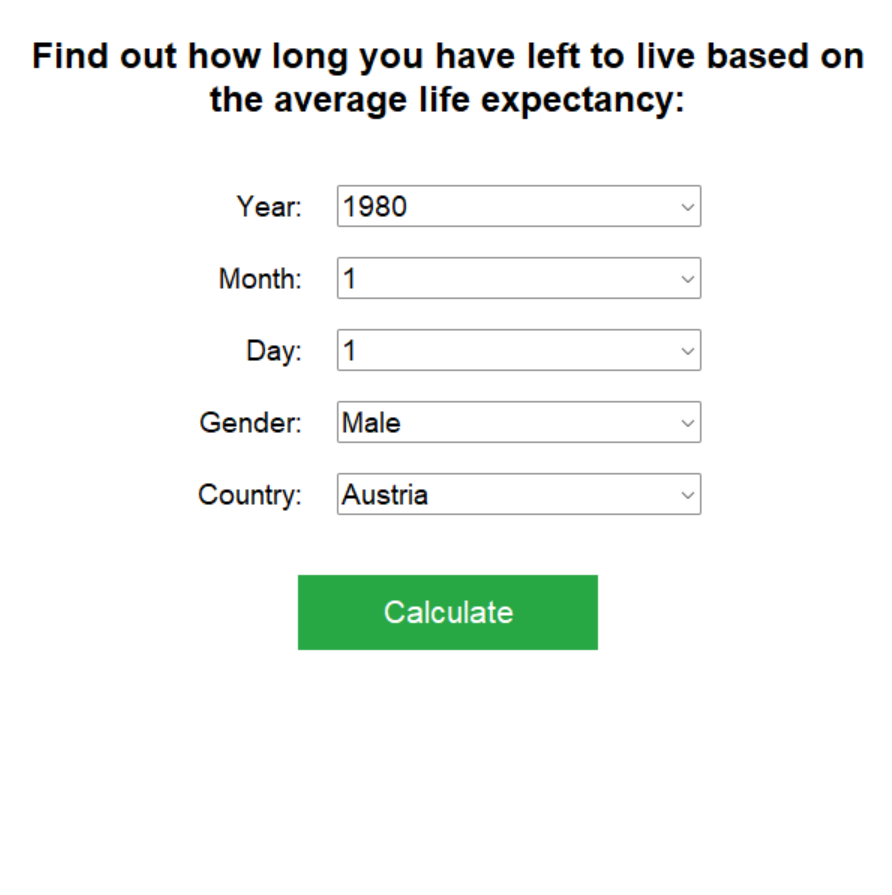
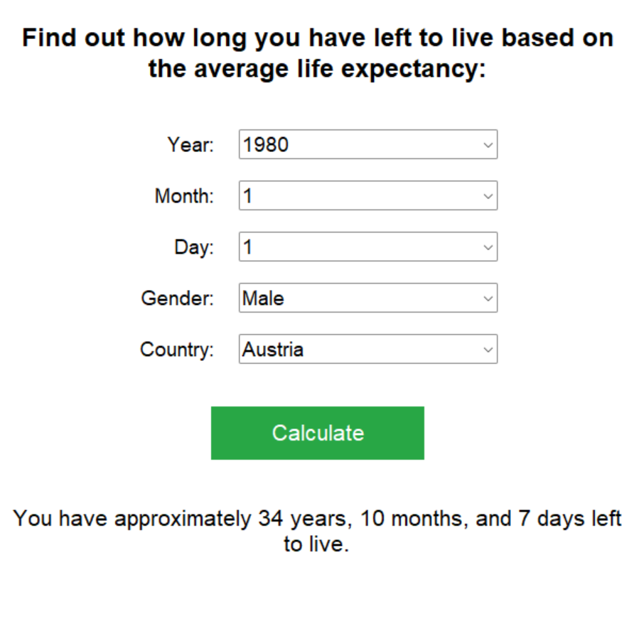

# Life Expectancy Calculator
## Screenshots






A simple GUI application that calculates the remaining time a user has left to live based on the average life expectancy for a selected country.  
The program uses Python’s Tkinter library for a **nice user interface** and reads a CSV file for country‐specific life expectancy data.

---

## Overview

This application allows the user to:

- Enter their birth date (year, month, day).  
- Select their gender.  
- Choose a country from a CSV file containing life expectancy data.  

It then **calculates** the approximate remaining time to live, given the average life expectancy for that country.  
It features a modern UI with a custom rounded button and error handling for invalid inputs.

---

## Features

- **Graphical User Interface** built with Tkinter for a clean and intuitive experience.  
- **Custom Rounded Button**: A modern look for the “Calculate” button.  
- **CSV Data Integration**: Reads a simple CSV file containing life expectancy data from a Python dictionary.  
- **Dynamic Calculation**: Computes the remaining (or exceeded) life expectancy based on user input.  
- **Requirements**: Python 3.x, Tkinter (included with Python distributions by default), and a CSV file containing life expectancy data.

---

## How to Run

1. Clone or download this repository.  
2. Ensure you have **Python 3.x** installed.  
3. Make sure you have a CSV file named `life_expectancy_data.csv` with your country data.  
4. Run the Python script (e.g., `python main.py` or `python3 main.py`).

---

## Example CSV Format

```csv
Country,Male,Female
Germany,79.0,83.5
Austria,79.3,84.2
USA,76.3,81.4
...
